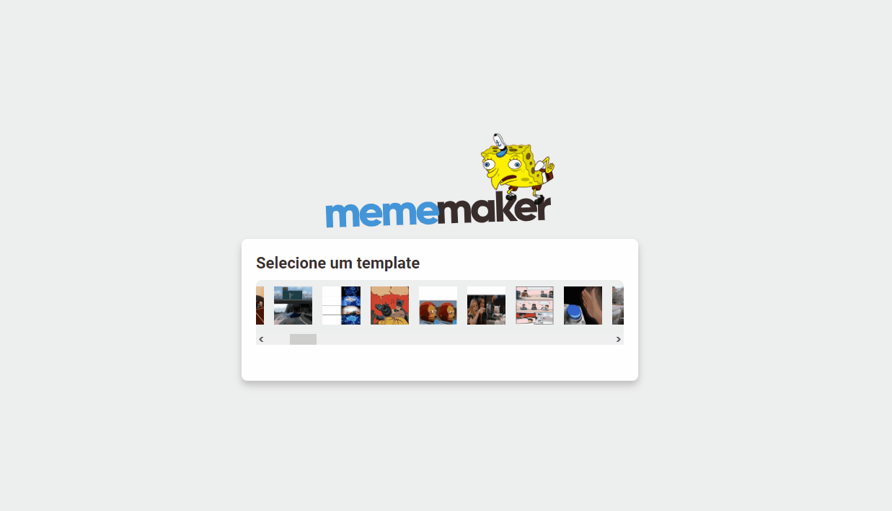

____

Projeto executado seguindo a [video aula](https://www.youtube.com/watch?v=Yajip86C8sg) do Mateus Silva. O gerador de memes usa uma api que nos fornece as imagens, a quantidade de texto e a posição que eles devem ficar. 

- React
- Styled Components
- Imgflip API

## Preview

## Instalação:

#### Pré requisito:
- Node.JS

#### Siga os seguintes passos: 

- Clone este repositorio:
  > $ git clone https://github.com/maateusilva/mememaker.git

- Instale o yarn (ou npx)
  > $ yarn install / npm install

- Execute o comando baixo: 
    > $ yarn start # ou npm start
